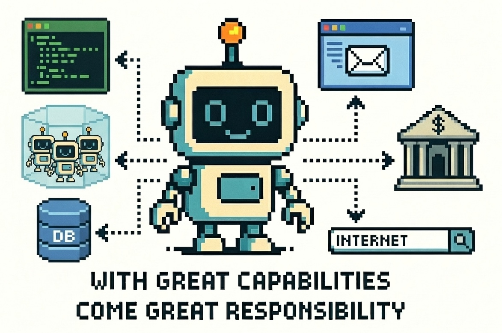

# Agentic Risk & Capability Framework



**The ARC Framework is a technical governance framework for identifying, assessing, and mitigating safety and security risks in agentic AI systems.** The framework provides:

- A hierarchical capability taxonomy for classifying agentic system capabilities
- A structured risk mapping distinguishing component, design, and capability-specific risks
- Technical control specifications with risk-to-control mappings
- An implementation methodology for organisational adoption and per-system assessment

!!! info "Major Update"

    We have significantly updated the ARC Framework based on feedback received. The main changes include:

    - **New theoretical foundation**: Added comprehensive [Introduction](arc_framework/introduction.md) with design rationale, literature review, real-world case studies (Replit, Antigravity incidents), and detailed justification for the capability-based approach
    - **Restructured documentation**: Consolidated Components and Design elements into a unified [Elements](arc_framework/elements.md) reference page with clearer taxonomy and detailed definitions
    - **Interactive Risk Register**: Introduced a [filterable, searchable risk register](arc_framework/risk-register.md) consolidating all 46 risks and 88 controls with risk-to-control mappings in a single interactive interface
    - **Framework positioning**: Added [Comparison Table](arc_framework/comparison.md) benchmarking ARC against NIST AI RMF, ISO 42001, EU AI Act, OWASP, and other governance frameworks
    - **Research publications**: Published two technical papers available in [Resources](resources/index.md) — the IASEAI 2026 conference paper and the ARCvisor preprint
    - **ARCvisor tool**: Launched [ARCvisor](resources/index.md#arcvisor), an AI-powered risk assessment assistant achieving 50%+ time savings with live demo and open-source repository
    - **Enhanced implementation guidance**: Updated implementation guides with more detailed methodologies for both organizational adoption and per-system assessment

## Navigation

On this website, you'll find all the resources you need to get started with understanding and applying the ARC Framework in your organisation.

### 📚 Reference Documentation
- **[Framework Introduction](arc_framework/introduction.md)** — Design rationale, literature review, and theoretical foundation
- **[Agentic System Elements](arc_framework/elements.md)** — Detailed examination of components, design, and capabilities
- **[Capability Taxonomy](arc_framework/elements.md#capabilities)** — Cognitive, interaction, and operational capability categories with definitions
- **[Risk Register](arc_framework/risk-register.md)** — Component, design, and capability-specific risks with impact/likelihood assessment
- **[Comparison Table](arc_framework/comparison.md)** — Comparison to NIST AI RMF, ISO 42001, EU AI Act, OWASP, and other frameworks

### 🛠️ Implementation Guides
- **[Implementation Overview](implementation/index.md)** — Macro and micro implementation levels, timelines, and resources
- **[Organisational Adoption](implementation/for-governance-teams.md)** — Multi-phase rollout methodology for governance teams
- **[System Assessment](implementation/for-ai-developers.md)** — Per-system risk assessment process for developers

### 🧰 Tools & Resources
- **[ARCvisor Tool](resources/index.md#arcvisor)** — Open-source web application for automated risk assessment (50%+ time savings)
- **[Resources](resources/index.md)** — Slide deck, paper, and code for implementing the ARC Framework for your organisation

## Referenced By

The ARC framework has been mentioned in:

* [Cybersecurity Agency of Singapore's draft Addendum on Securing Agentic AI](https://isomer-user-content.by.gov.sg/36/703ff9fe-9db1-4e09-98c2-89e3d7007ef0/Draft%20Addendum%20on%20Securing%20Agentic%20AI%20[For%20Public%20Consultation].pdf)
* [Opening Address by Minister Josephine Teo at HLP (AI) on 22 Oct 2025](https://www.csa.gov.sg/news-events/speeches/opening-address-by-minister-josephine-teo-at-hlp--ai--on-22-oct-2025/#:~:text=20.%C2%A0%C2%A0%C2%A0%C2%A0%C2%A0%C2%A0%C2%A0%20First%2C%20we,can%20trust%20autonomy.)
* [AI Agents and Global Governance: Analyzing Foundational Legal, Policy, and Accountability Tools by Talita Dias (Partnership on AI)](https://partnershiponai.org/wp-content/uploads/2025/09/agents-policy-analysis.pdf?vgo_ee=uag8GfRQtHHxKE9ENGhTyS97XYF3rhM%3D%3AZ%2BYB5WRdklLrdWegdiC1Lb9RPOHzTLfW)
* [Engineering responsible AI: How Singapore builds trust in emerging technologies by GovTech Singapore](https://www.tech.gov.sg/technews/engineering-responsible-ai/)

## About the Authors

The ARC Framework is developed by the Responsible AI team in GovTech Singapore's AI Practice. We develop deep technical capabilities in Responsible AI to improve how the Singapore government develops, evaluates, deploys, and monitors AI systems in a safe, trustworthy, and ethical manner.

In developing this framework, we work closely with other teams in the Singapore government, such as the Ministry for Digital Development and Information, the Cybersecurity Agency of Singapore, and the Infocomm Media Development Authority. We are grateful for their feedback and contributions, which have helped to make this framework more effective, robust, and thorough.

To reach out to us, please fill out the Google form <a href="https://forms.gle/KoXecxDuPHf8izP2A" target="_blank">here</a>.

## Citation

To cite this work, please use the following BibTeX citation:

```
@article{agentic_risk_capability_framework,
    title   = {Agentic Risk & Capability Framework},
    author  = {GovTech Singapore},
    year    = {2025},
    month   = {December},
    url     = {https://govtech-responsibleai.github.io/agentic-risk-capability-framework/}
}
```

Alternatively, you may use the APA-formatted citation below:

> GovTech Singapore (2025) Agentic Risk & Capability Framework. URL <https://govtech-responsibleai.github.io/agentic-risk-capability-framework/>

*This page was last updated on 23 Dec 2025*